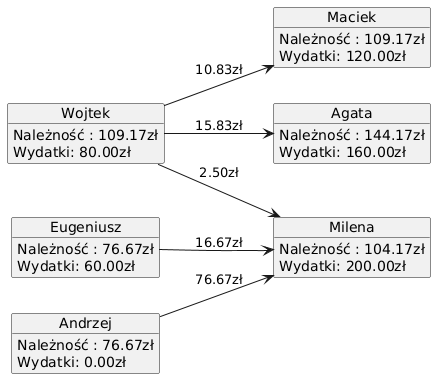

# Raport rozliczeniowy wydatków grupowych

### Uczestnicy rozliczenia
- Maciek
- Agata
- Wojtek
- Milena
- Eugeniusz
- Andrzej

---
### Wydatki
#### Zakupy spożywcze
**Płacący:** Maciek  
**Kwota:** 120.00 zł  
**Beneficjenci wydatku:** Maciek, Agata, Wojtek  
**Należność na głowę:** 40.00 zł

#### Bilety do kina
**Płacący:** Agata  
**Kwota:** 90.00 zł  
**Beneficjenci wydatku:** Maciek, Agata, Wojtek, Milena  
**Należność na głowę:** 22.50 zł

#### Pizza
**Płacący:** Wojtek  
**Kwota:** 80.00 zł  
**Beneficjenci wydatku:** Maciek, Agata, Wojtek, Milena, Eugeniusz, Andrzej  
**Należność na głowę:** 13.33 zł

#### Taxi
**Płacący:** Eugeniusz  
**Kwota:** 60.00 zł  
**Beneficjenci wydatku:** Eugeniusz, Andrzej  
**Należność na głowę:** 30.00 zł

#### Hotel
**Płacący:** Milena  
**Kwota:** 200.00 zł  
**Beneficjenci wydatku:** Maciek, Agata, Wojtek, Milena, Eugeniusz, Andrzej  
**Należność na głowę:** 33.33 zł

#### Dyskoteka
**Płacący:** Agata  
**Kwota:** 70.00 zł  
**Beneficjenci wydatku:** Agata, Milena  
**Należność na głowę:** 35.00 zł

---
### Indywidualny koszt
|Osoba|Należność|
|---|---|
|Maciek|109.17 zł|
|Agata|144.17 zł|
|Wojtek|109.17 zł|
|Milena|104.17 zł|
|Eugeniusz|76.67 zł|
|Andrzej|76.67 zł|
---
### Rozliczenie

Wojtek --- 10.83 zł ---> Maciek

Wojtek --- 15.83 zł ---> Agata

Wojtek --- 2.50 zł ---> Milena

Eugeniusz --- 16.67 zł ---> Milena

Andrzej --- 76.67 zł ---> Milena

---
### Diagram rozliczenia

*Raport wygenerowano: 14-05-2025 14-12-40*